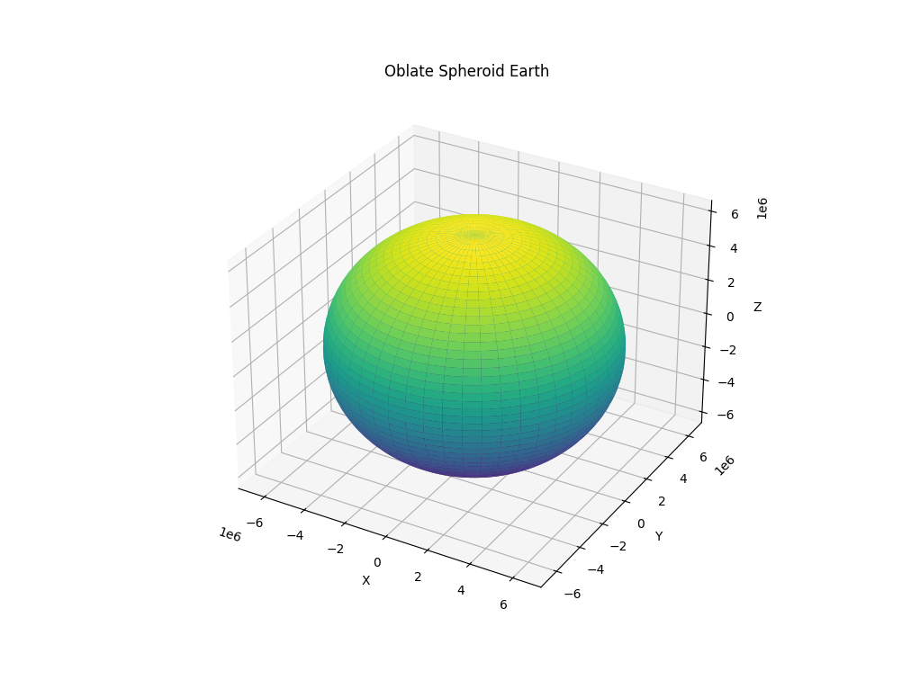

# Modeling Earth's Oblate Spheroid Shape

This code generates a model of Earth's oblate ellipsoidal shape resulting from its rotation. It visualizes the physics described in provided paper "Bridging Quantum Mechanics and General Relativity Through Tautochrone-Encoded Probability Polytopes".

## Summary

The paper outlines a technique using tautochrone curve facets on a convex polytope to model the oblate ellipsoidal shape of Earth arising from its rotation. Centrifugal forces at the equator combined with gravitational forces result in an oblate or "squashed" sphere shape rather than a perfect sphere.

This code calculates the gravitational and centrifugal potentials to derive Earth's oblate spheroid equation. It then generates a 3D mesh and plots the shape. Key parameters include Earth's radii, density, and rotational velocity.

## Code Overview

The main steps are:

1. Define Earth parameters (mass, radius, density, gravity, angular velocity)
2. Calculate gravitational force and centrifugal force
3. Derive oblate spheroid shape equation from balance of forces
4. Generate 3D meshgrid
5. Plot oblate spheroid with Matplotlib

## Example Output

## Usage

To run the code:
use plot.py
Requires `numpy`, `matplotlib`, and `mplot3d`.
